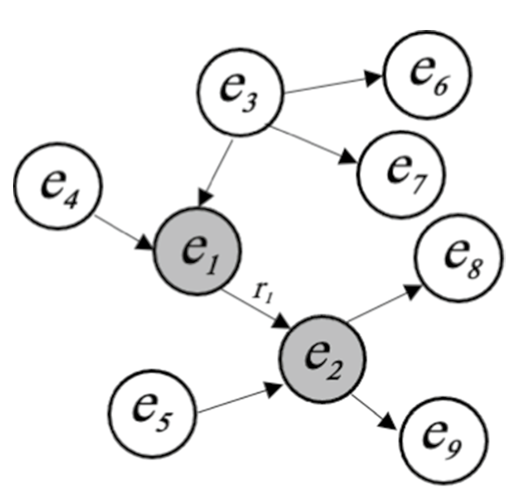

###        Identifying Russian Disinformation Propagator Content on X using Knowledge Graphs and Graph Convolutional Networks

#### What is this project about?

This project is focused on using a dataset containing identified Russian disinformation tweets from 2015-2017[1] provided by FiveFirtyEight, as well as a control dataset in the form of the Twitter sentiment analysis dataset from Kaggle [2], to train a Graph Convolutional Network on a word resonance graph resembling the tweets to classify whether a tweet came from a disinformation propagator or not.

#### Theoretical Background

##### 1. Knowledge Graphs

A Knowledge Graph (KG) is defined as a directed graph, conveying knowledge about objects and their relations. Each edge represents the semantic relation, whilst each node represents an object. The fundamental building block of KG’s are triplets of the form (subject, predicate, object) or in short (edge, relation, edge). As semantic relations are not symmetric these graphs are directed, with edges pointing from subject to respective object [3]. The following Figure 1, presents a simple example of a KG [4]:

##### 2. Resonance Graphs

To measure the interaction between respective users, this report makes use of a resonance graph, a network representing the normalized word resonance between users as a measure of discursive similarity. 

The word resonance between twitter contents A and B, $WR_{AB}$, as follows [5]:

$$WR = (I_A \cdot I_B) \forall v \in \{V_A \cap V_B\}$$

Where $I_A$ and $I_B$ represent the betweenness centrality of a respective node in the KG of the tweets. The betweenness centrality of a node is defined as follows [6]:

$$I(v) = \sum_{s, t \in v} \frac{\sigma(s, t|v)}{\sigma(s,t)}$$

Where $\sigma(s,t)$ is the number of shortest paths in the KG and $\sigma(s,t|v)$ is the number of shortest paths going through node $v$.

Next the word resonance was standardized such that [5]:

$$\overline{WR}_{AB} =\frac{WR}{ \sqrt{\sum_i I_i^A \cdot \sum_i I_i^B}}$$

This standardized measure could then be used to create a resonance matrix [5]:

$$m_{ij} = \left\lbrace 
  \begin{array}{ c l }
    \overline{WR}_{ij} & \quad \textrm{if } i \neq j \\
    0                 & \quad \textrm{if } i = j
  \end{array}
\right.$$

Finally, using a hyperparameter threshold, τ, the adjacency matrix of the resonance graph was defined as [5]:

$$a_{ij} = \left\lbrace 
  \begin{array}{ c l }
    1 & \quad \textrm{if } m_{ij} \geq \tau \\
    0                 & \quad \textrm{if } m_{ij} < \tau
  \end{array}
\right.$$

#### Notebook Outline

The notebook firstly applies some exploratory data analysis on the 2 datasets, then after applying preliminary natural language processing, the theory above is implemented to construct knowledge graphs and then word resonance graphs.

Following this step, a Graph Convolutional Network (GCN) is trained for binary classification using the `pytorch_geometric` library[7]. Example outputs and plots, as well as code comments and descriptions are provided throughout the notebook and a html file with pre-run outputs is provided as run times were relatively long for some calculations and the network training process.

#### Future Improvements

Some ideas for further work with the possibility of improving these results are, the use of more complicated network architectures and the use of larger and in the case of the control data, more represantative datasets.

#### References

##### 1. Data
[1] O. Roeder, “Why We’re sharing 3 Million Russian Troll Tweets”, FiveThirtyEight by abc News, 31.07.2018, https://fivethirtyeight.com/features/why-were-sharing-3-million-russian-troll-tweets/

[2] “Twitter Sentiment Analysis”, Kaggle, 2021,https://www.kaggle.com/datasets/jp797498e/twitter-entity-sentiment-analysis/data

##### 2. Theory

[3] C. Pen, F. Xia et al., “Knowledge Graphs: Opportunities and Challenges, Artificial Intelligence Review (2023), 56:13071-13102, 03.04.2023, https://www.researchgate.net/publication/369758742_Knowledge_Graphs_Opportunities_and_Challenges

[4] T. Pederson, S. Patwardhan, J. Michelizzi, “WordNet::Similarity – Measuring the Relatedness of Concepts”, The Association for the Advancement of Artificial Intelligence, AAAI 04-160, 2004, https://cdn.aaai.org/AAAI/2004/AAAI04-160.pdf

[5] M. Bailey, “Detecting Propagators of Disinformation on Twitter Using Quantitative Discursive Analysis”, 2022, https://arxiv.org/abs/2210.05760

[6] U. Brandes, "A Faster Algorithm for Betweenness Centrality," Journal of Mathematical Sociology, vol. 25, no. 2, pp. 163-177, 2001, https://www.researchgate.net/publication/2887625_A_Faster_Algorithm_for_Betweenness_Centrality

[7] https://pytorch-geometric.readthedocs.io/en/2.5.0/generated/torch_geometric.nn.models.GCN.html (2024)

##### 3. Code

[8] M. Bernstein, “Graph Convolutional Neural Networks”, 24.09.2023, https://mbernste.github.io/posts/gcn/

[9] P. Sanagapati, “Knowledge Graph & NLP Tutorial-(BERT,spaCy,NLTK)”, Kaggle, 2021, https://www.kaggle.com/code/pavansanagapati/knowledge-graph-nlp-tutorial-bert-spacy-nltk

